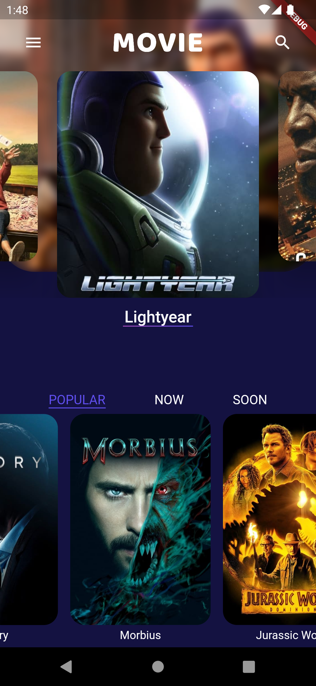

# Movies

App build with Flutter using best practices of Clean Architecture.

This app is based on the series presented by [TechieBlossom](https://github.com/TechieBlossom/movie_app_tutorial/) at [Youtube](https://www.youtube.com/playlist?list=PL342JVRNQxEAcQdnNeN0JmMzfcm6VtLxS).

Hope this help other developers to accept the challenge of improving coding skills one step at a time.

